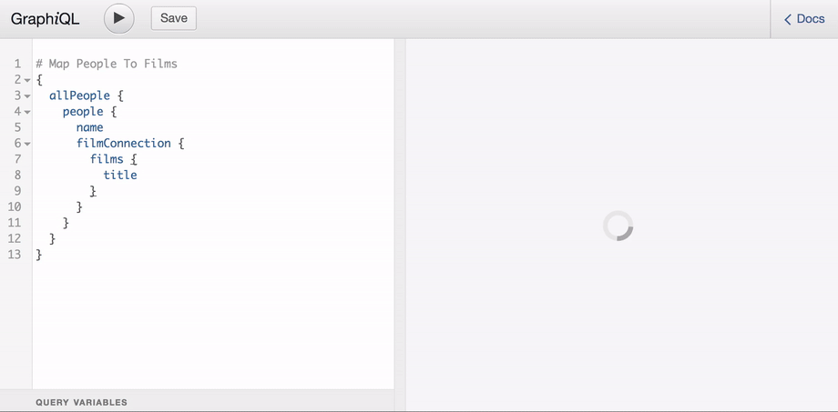
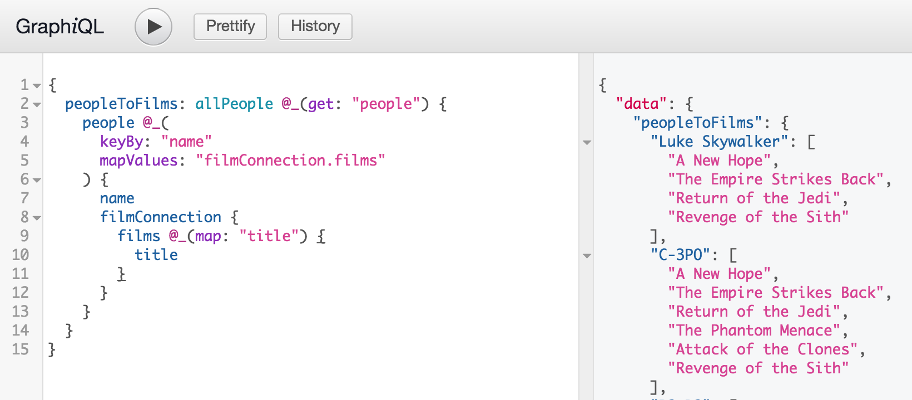
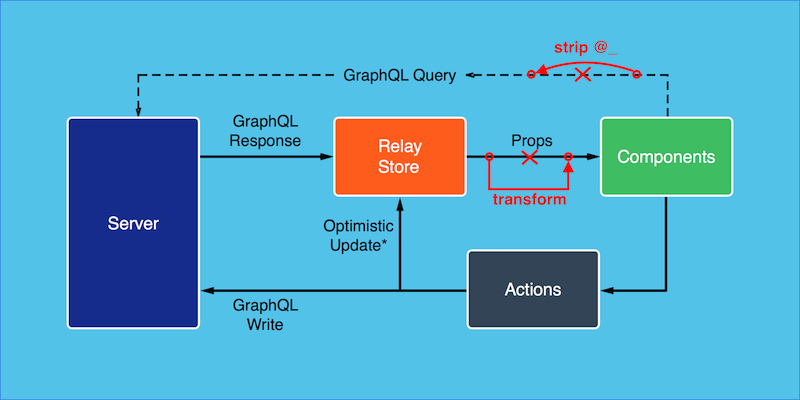

# GraphQL Lodash
[](https://www.npmjs.com/package/graphql-lodash) [](https://david-dm.org/APIs-guru/graphql-lodash)
[](https://david-dm.org/APIs-guru/graphql-lodash?type=dev)
[](https://github.com/APIs-guru/graphql-lodash/blob/master/LICENSE)

Unleash the power of [lodash](https://lodash.com/) inside your GraphQL queries

## Why?
GraphQL allows to ask for what you need and get exactly that. But what about the shape?
GraphQL Lodash gives you the power of `lodash` right inside your GraphQL Query using `@_` directive.

[](https://apis.guru/graphql-lodash/)

**Note**: This is an **experimental** project created to explore the concept of **Query and transformation collocation**.

We encourage you to try it inside our [demo](https://apis.guru/graphql-lodash/) or check detailed [walkthrough](https://docs.google.com/presentation/d/1aBXjC98hfYrbjUKlWGFMWgAMh9FcxeW_w97uatNYXls/pub?start=false&loop=false&delayms=3000).
Here are a few query examples you can run against StartWars API:

#### Find out a plannet with the biggest population

#### Get gender statistics

#### Map characters to films they are featured in


## Install

    npm install --save graphql-lodash
or

    yarn add graphql-lodash

## API

### `graphqlLodash(query, [operationName])`

- **query** (_required_) - query string or query AST
- **operationName** (_optional_) - required only if the query contains multiple operations

### Returns
```
{
  query: string|object,
  transform: Function
}
```
- **query** - the original query with stripped `@_` directives
- **transform** - function that recieves `response.data` as a single argument and returns
the same data in the intended shape.


## Usage Examples

The simplest way to integrate `graphql-lodash` is to write wrapper function for graphql client of you choice:
```js
import { graphqlLodash } from 'graphql-lodash';

function lodashQuery(queryWithLodash) {
  let { query, transform } = graphqlLodash(queryWithLodash);
  // Make a GraphQL call using 'query' variable as a query
  // And place result in 'result' variable
  ...
  result.data = transform(result.data);
  return result;
}
```

### Fetch example
An example of a simple client based on [fetch API](https://developer.mozilla.org/en/docs/Web/API/Fetch_API):
```js
function executeGraphQLQuery(url, query) {
  return fetch(url, {
    method: 'POST',
    headers: new Headers({"content-type": 'application/json'}),
    body: JSON.stringify({ query: query })
  }).then(response => {
    if (response.ok)
      return response.json();
    return response.text().then(body => {
      throw Error(response.status + ' ' + response.statusText + '\n' + body);
    });
  });
}

function lodashQuery(url, queryWithLodash) {
  let { query, transform } = window.GQLLodash.graphqlLodash(queryWithLodash);
  return executeGraphQLQuery(url, query).then(result => {
    result.data = transform(result.data);
    return result;
  });
}

// then use as bellow
lodashQuery('https://swapi.apis.guru', `{
  planetWithMaxPopulation: allPlanets @_(get: "planets") {
    planets @_(maxBy: "population") {
      name
      population
    }
  }
}`).then(result => console.log(result.data));
```

### Caching clients
For caching clients like Relay and Apollo we recommend to apply the transformation after the caching layer.
Here is proposed solution for Relay:



We are still figuring out how to do this and any [feedback](https://github.com/APIs-guru/graphql-lodash/issues/new) is welcome.

#### Usage with [react-apollo](https://github.com/apollographql/react-apollo)

When using with Apollo you can use `props` option to apply transformations:

```js
const rawQuery = gql`
  # query with @_ directives
`;

const {query, transform} = graphqlLodash(rawQuery);
export default graphql(query, {
  props: (props) => ({...props, rawData: props.data, data: transform(props.data)})
})(Component);
```

You can write a simple wrapper for simplicity:

```js
import { graphql } from 'react-apollo';
import { graphqlLodash } from 'graphql-lodash';

export function gqlLodash(rawQuery, config) {
  const {query, transform} = graphqlLodash(rawQuery);
  let origProps = (config && config.props) || ((props) => props);

  return (comp) => graphql(query, {...config,
    props: (props) => origProps({
      ...props,
      rawData: props.data,
      data: transform(props.data)
    })
  })(comp);
}
// then use as bellow
export default gqlLodash(query)(Component);
```

Just replace `graphql` with `gqlLodash` and you are ready to use lodash in your queries.
Check out [react-apollo-lodash-demo](https://github.com/APIs-guru/react-apollo-lodash-demo) repo.

## Usage on server side

In theory, this tool can be used on the server. But this will break the contract and, most likely,
will break all the GraphQL tooling you use. Use it on server-side only if you know what you do.
